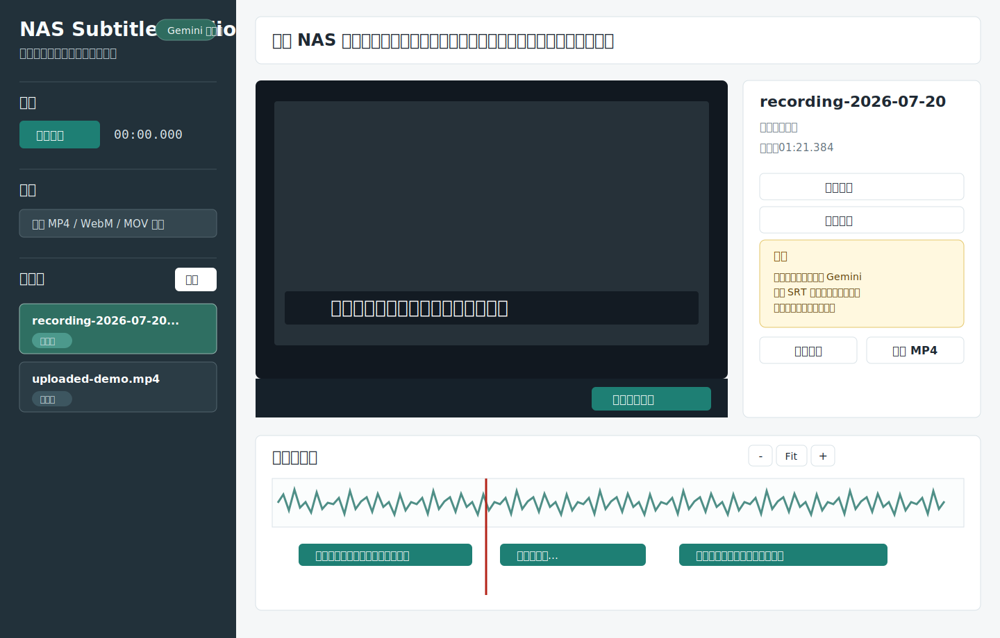
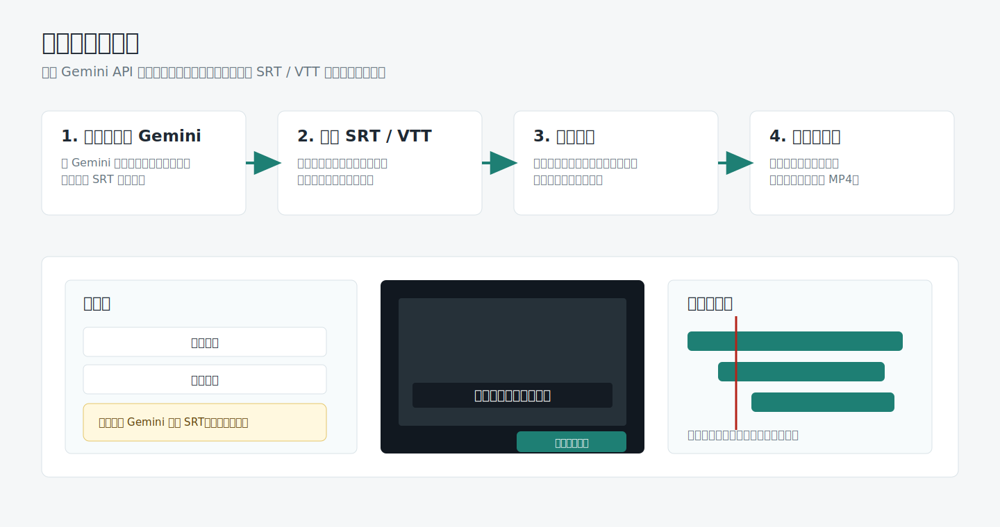
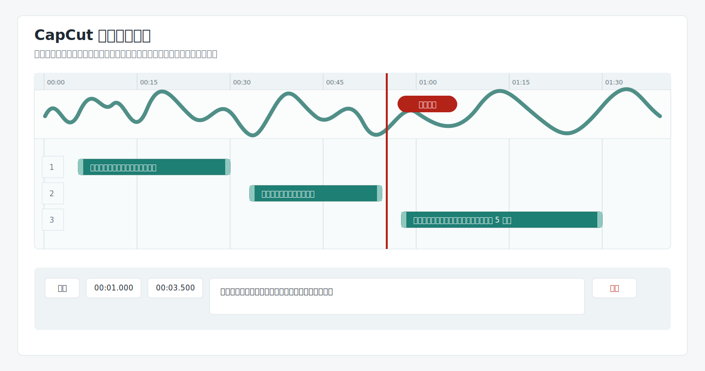
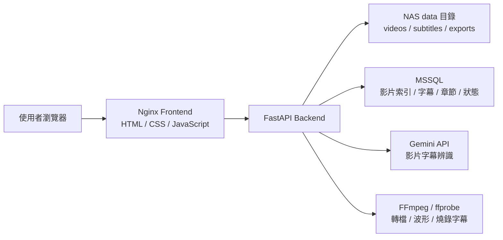
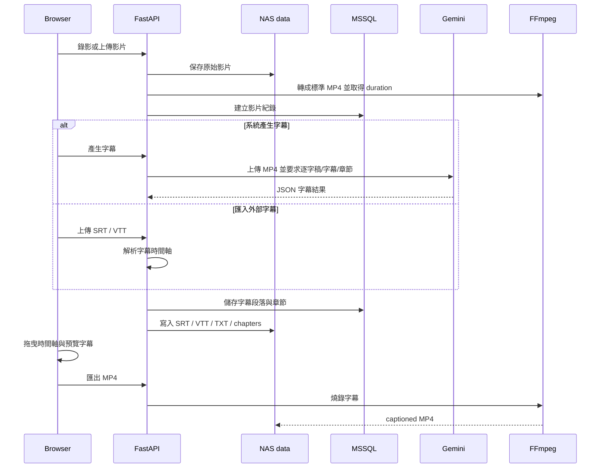

# NAS Subtitle Studio

NAS Subtitle Studio 是一套部署在 NAS 上的影片字幕工作台，目標是把「錄影、上傳、產字幕、匯入字幕、修時間軸、預覽字幕、匯出 MP4」收在同一個內網工具裡。

它不是傳統剪輯軟體，而是為教學影片、系統操作錄影、內部教育訓練與字幕交付流程打造的專用工具。所有影片、字幕、匯出檔都保留在 NAS，資料庫只保存索引、字幕段落、章節與處理狀態。

## 介面總覽



## 目前支援的工作流

### 1. 在系統內產生字幕

1. 直接用瀏覽器錄影，或上傳既有影片。
2. 後端先把錄影轉成標準 MP4，取得正確 duration。
3. 使用 Gemini API 產生逐字稿、字幕段落與章節。
4. 依照說話停頓、語氣中斷與段落切字幕，不再用固定 3 到 5 秒硬切。
5. 進入時間軸編輯器微調字幕。
6. 預覽字幕後匯出含字幕 MP4。

### 2. 匯入外部字幕

如果你已經用 Gemini 對話視窗、其他字幕工具或人工整理出 SRT/VTT，可以直接匯入字幕，不必重新跑系統內的字幕產生流程。



匯入後系統會：

- 解析 SRT / VTT 時間軸
- 保留每段字幕原本的開始與結束時間
- 依影片長度做必要裁切
- 寫入 MSSQL 與 NAS 字幕檔
- 進入可編輯狀態
- 支援上方播放器即時預覽字幕

### 3. 拖曳式字幕時間軸



時間軸支援：

- 人聲音訊波形
- 播放位置紅線
- 字幕片段拖曳移動
- 左右邊界拉伸調整長度
- 點擊時間軸跳到指定播放位置
- 放大、縮小、Fit 時間軸
- 上方播放器預覽目前字幕
- 編輯文字後即時更新字幕預覽

## 核心功能

- 瀏覽器螢幕錄影與麥克風錄音
- 螢幕音訊與麥克風混音
- 上傳 MP4 / WebM / MOV / MKV 等影片
- WebM 錄影自動轉標準 MP4
- 正確讀取影片 duration 後再產生字幕
- Gemini API 產生逐字稿、字幕與章節
- 匯入 SRT / VTT 外部字幕檔
- 字幕時間軸拖曳、拉伸、預覽與儲存
- 音訊波形產生與快取
- SRT / VTT / TXT / 章節 Markdown 下載
- FFmpeg 燒錄硬字幕並匯出 MP4
- MSSQL 儲存影片索引、字幕段落、章節與狀態
- Docker Compose 部署在 NAS
- 內網使用，不強制依賴 Tailscale 或反向代理

## 使用情境

- 軟體操作教學影片
- NAS / Docker / 系統維運教學
- 內部教育訓練影片
- 會議、課程、操作錄影的字幕整理
- 已有 SRT/VTT 字幕的時間軸整合
- 需要把影片與字幕留在 NAS 的本地工作流程

## 系統架構



## 資料流程



## 技術堆疊

| 層級 | 技術 |
|---|---|
| 前端 | 靜態 HTML / CSS / JavaScript |
| 入口 | Nginx |
| 後端 | Python 3.12 + FastAPI |
| AI 字幕 | Google Gemini API |
| 影片處理 | FFmpeg / ffprobe |
| 字幕格式 | SRT / VTT / TXT / Markdown chapters |
| 資料庫 | Microsoft SQL Server / MSSQL |
| 部署 | Docker Compose on NAS |

## 專案結構

```text
NAS-Subtitle-Studio.nas/
├─ backend/
│  ├─ Dockerfile
│  ├─ requirements.txt
│  └─ app/
│     ├─ main.py              # FastAPI routes
│     ├─ gemini_service.py    # Gemini 字幕辨識
│     ├─ subtitle_utils.py    # SRT/VTT 解析、輸出與時間軸整理
│     ├─ video_tools.py       # FFmpeg 轉檔、波形、燒錄字幕
│     ├─ storage.py           # MSSQL / SQLite 儲存層
│     └─ runtime_settings.py  # Gemini API Key runtime 設定
├─ frontend/
│  ├─ Dockerfile
│  └─ static/
│     ├─ index.html
│     ├─ app.js
│     └─ styles.css
├─ database/
│  ├─ mssql_create_database.sql
│  └─ mssql_schema.sql
├─ docs/
│  ├─ images/
│  ├─ ARCHITECTURE.md
│  ├─ DEVELOPMENT.md
│  └─ GITHUB_RELEASE.md
├─ scripts/
├─ docker-compose.yml
├─ nginx.conf
├─ .env.example
└─ DEPLOY_NAS.md
```

## 快速部署

在 NAS 上：

```bash
cd /volume1/NewStorage/NAS-Subtitle-Studio.nas
cp .env.example .env
vi .env
```

填入 MSSQL 與 Gemini 設定後：

```bash
sudo /usr/local/bin/docker-compose build --no-cache backend frontend
sudo /usr/local/bin/docker-compose run --rm backend python scripts/create_mssql_database.py --database NASSubtitleStudio
sudo /usr/local/bin/docker-compose up -d
```

開啟：

```text
http://NAS_IP:54320
```

## Gemini API Key

可在網頁左側「Gemini API」欄位輸入並儲存。儲存後會寫入 NAS 掛載資料：

```text
data/studio_settings.json
```

這個檔案不應上傳 GitHub。

## MSSQL 資料表

```text
dbo.nas_subtitle_videos
dbo.nas_subtitle_segments
dbo.nas_subtitle_chapters
```

影片本體不存進 MSSQL，避免資料庫被大型媒體檔塞滿；MSSQL 只保存索引、字幕、章節與狀態。影片與匯出檔保存在 NAS `data/`。

## 瀏覽器錄影限制

瀏覽器螢幕錄影 API 需要安全來源。如果只用內網 HTTP，例如：

```text
http://192.168.66.53:54320
```

Chrome / Edge 可能不開放螢幕錄影。可使用專案內的：

```text
open_chrome_recording_mode.cmd
```

它會用 Chrome 的安全來源例外模式開啟內網網址。

## 文件

- [NAS 部署手冊](DEPLOY_NAS.md)
- [架構與資料流程](docs/ARCHITECTURE.md)
- [開發者指南](docs/DEVELOPMENT.md)
- [GitHub 上架檢查清單](docs/GITHUB_RELEASE.md)
- [安全與金鑰管理](SECURITY.md)

## 授權

目前未指定開源授權。若要公開給外部使用者，請先決定是否加入 MIT / Apache-2.0 / 私有授權。
