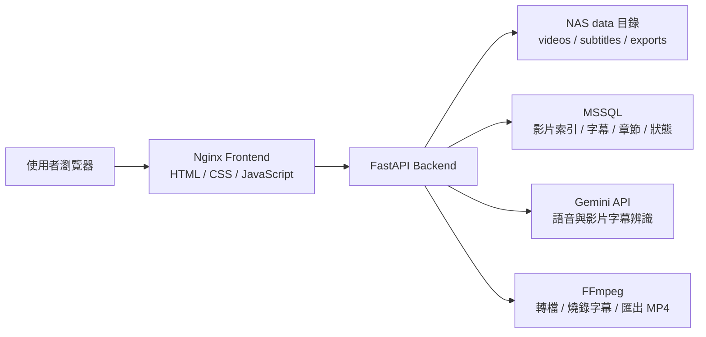
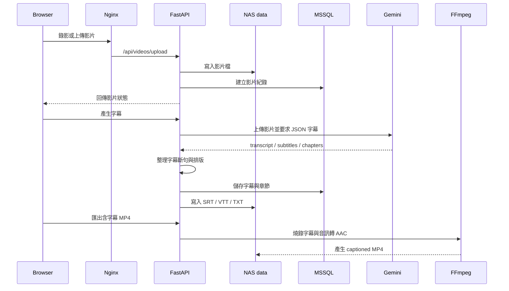

# NAS Subtitle Studio

NAS Subtitle Studio 是一套可自架在 NAS 上的影片錄製、上傳、AI 字幕辨識、字幕編輯與含字幕 MP4 匯出工具。  
它的定位不是多軌剪輯軟體，而是「錄製教學影片 → 產生字幕 → 修字幕 → 匯出可交付影片」的單一工作流。

## 功能

- 瀏覽器螢幕錄影與麥克風錄音
- 上傳既有影片檔
- Gemini API 產生逐字稿、字幕與章節
- 字幕段落編輯、時間軸校正、章節編輯
- 字幕排版整理：短句、兩行內、約 5 秒內切換
- FFmpeg 燒錄硬字幕並匯出 MP4
- MSSQL 儲存影片索引、字幕段落、章節與處理狀態
- NAS Docker Compose 部署
- 內網 IP 使用，不強制依賴 Tailscale 或反向代理

## 使用情境

- 軟體操作教學影片
- NAS / Docker / 系統維運教學
- 內部教育訓練影片
- 已錄製影片的字幕產生與整理
- 需要保留影片檔與字幕檔的本地工作流程

## 系統架構



## 資料流程



## 技術堆疊

| 層級 | 技術 |
|---|---|
| 前端 | 靜態 HTML / CSS / JavaScript |
| 入口 | Nginx |
| 後端 | Python 3.12 + FastAPI |
| AI 字幕 | Google Gemini API |
| 影片處理 | FFmpeg / ffprobe |
| 字幕格式 | SRT / VTT / TXT / Markdown chapters |
| 資料庫 | Microsoft SQL Server / MSSQL |
| 部署 | Docker Compose on NAS |

## 專案結構

```text
NAS-Subtitle-Studio.nas/
├─ backend/
│  ├─ Dockerfile
│  ├─ requirements.txt
│  └─ app/
│     ├─ main.py              # FastAPI routes
│     ├─ gemini_service.py    # Gemini 字幕辨識
│     ├─ subtitle_utils.py    # SRT/VTT 與字幕排版整理
│     ├─ video_tools.py       # FFmpeg 轉檔與燒錄字幕
│     ├─ storage.py           # MSSQL / SQLite 儲存層
│     └─ runtime_settings.py  # Gemini API Key runtime 設定
├─ frontend/
│  ├─ Dockerfile
│  └─ static/
│     ├─ index.html
│     ├─ app.js
│     └─ styles.css
├─ database/
│  ├─ mssql_create_database.sql
│  └─ mssql_schema.sql
├─ scripts/
│  ├─ create_mssql_database.py
│  ├─ create_mssql_database.ps1
│  └─ check_mssql_connection.py
├─ docker-compose.yml
├─ nginx.conf
├─ .env.example
└─ DEPLOY_NAS.md
```

## 快速部署

在 NAS 上：

```bash
cd /volume1/NewStorage/NAS-Subtitle-Studio.nas
cp .env.example .env
vi .env
```

填入 MSSQL 與 Gemini 設定後：

```bash
sudo /usr/local/bin/docker-compose build --no-cache backend frontend
sudo /usr/local/bin/docker-compose run --rm backend python scripts/create_mssql_database.py --database NASSubtitleStudio
sudo /usr/local/bin/docker-compose up -d
```

開啟：

```text
http://NAS_IP:54320
```

## Gemini API Key

可在網頁左側「Gemini API」欄位輸入並儲存。  
儲存後會寫入 NAS 掛載資料：

```text
data/studio_settings.json
```

這個檔案不應上傳 GitHub。

## MSSQL 資料表

```text
dbo.nas_subtitle_videos
dbo.nas_subtitle_segments
dbo.nas_subtitle_chapters
```

影片本體不存進 MSSQL，避免資料庫被大型媒體檔塞滿；MSSQL 只保存索引、字幕、章節與狀態。影片與匯出檔保存在 NAS `data/`。

## 字幕排版規則

- 每段字幕盡量控制在 3-5 秒
- 每段最多兩行
- 每行約 18 個中文字
- 長句依標點或長度切成下一段
- 硬字幕使用 Noto Sans CJK 字型
- 匯出 MP4 時音訊轉為 AAC，避免 webm/opus 來源掉音軌

## 瀏覽器錄影限制

瀏覽器螢幕錄影 API 需要安全來源。  
如果只用內網 HTTP，例如：

```text
http://192.168.66.53:54320
```

Chrome / Edge 可能不開放螢幕錄影。可使用專案內的：

```text
open_chrome_recording_mode.cmd
```

它會用 Chrome 的安全來源例外模式開啟內網網址。

## 文件

- [NAS 部署手冊](DEPLOY_NAS.md)
- [架構與資料流程](docs/ARCHITECTURE.md)
- [開發者指南](docs/DEVELOPMENT.md)
- [GitHub 上架檢查清單](docs/GITHUB_RELEASE.md)
- [安全與金鑰管理](SECURITY.md)

## 授權

目前未指定開源授權。若要公開到 GitHub，請先決定是否加入 MIT / Apache-2.0 / 私有授權。
