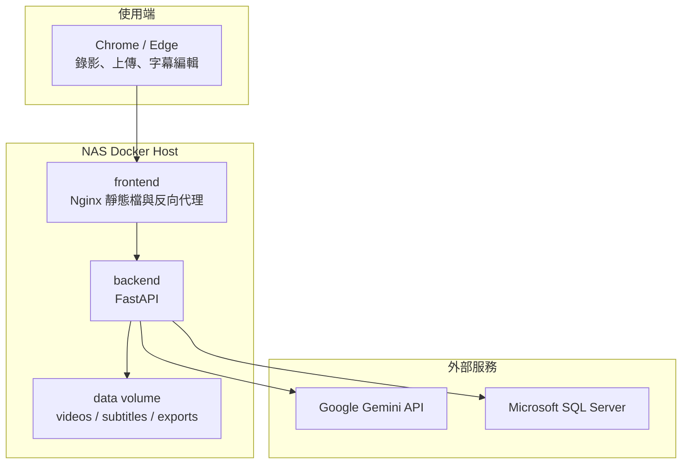
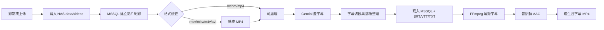

# 架構與資料流程

## 系統目標

NAS Subtitle Studio 的目標是建立一套可自架、可內網使用、資料可控的影片字幕工作台。  
它避免依賴大型剪輯軟體，只處理錄影、上傳、字幕辨識、字幕編輯與硬字幕匯出。

## 架構圖



## 容器

| 服務 | 說明 | 對外 |
|---|---|---|
| frontend | Nginx 靜態前端與 `/api` proxy | `54320:80` |
| backend | FastAPI、Gemini、FFmpeg、MSSQL 存取 | 只在 Docker network |

## 影片處理流程



## 字幕資料

字幕會同時保存在：

- MSSQL：供網頁編輯與狀態查詢
- NAS `data/subtitles`：供下載 SRT / VTT / TXT / chapters

## 為什麼影片不進 MSSQL

影片檔案可能很大，不適合放進關聯式資料庫。  
本專案採用：

```text
MSSQL = metadata / subtitle / chapter / status
NAS filesystem = video / subtitle files / exports
```

這樣備份、搬移與效能都比較可控。
