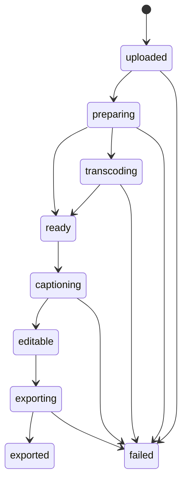

# 開發者指南

## 開發環境

建議：

- Python 3.12
- Docker / Docker Compose
- FFmpeg
- MSSQL Server
- Google Gemini API Key

## 後端本機啟動

```powershell
cd F:\AI股票投資分析\NAS-Subtitle-Studio.nas\backend
py -3.12 -m venv .venv
.\.venv\Scripts\Activate.ps1
pip install -r requirements.txt
uvicorn app.main:app --host 0.0.0.0 --port 54330 --reload
```

## 前端本機開發

前端是純靜態檔，不需要 npm build。

```text
frontend/static/index.html
frontend/static/app.js
frontend/static/styles.css
```

正式部署由 Nginx 容器提供靜態檔。

## Docker 建置

```bash
docker-compose build --no-cache backend frontend
docker-compose up -d
```

## 主要 API

| Method | Path | 說明 |
|---|---|---|
| GET | `/api/health` | 健康檢查 |
| GET | `/api/videos` | 影片列表 |
| POST | `/api/videos/upload` | 上傳影片 |
| GET | `/api/videos/{id}` | 影片詳情 |
| DELETE | `/api/videos/{id}` | 刪除影片與相關檔案 |
| POST | `/api/videos/{id}/caption` | 產生字幕 |
| PUT | `/api/videos/{id}/subtitles` | 儲存字幕 |
| POST | `/api/videos/{id}/export` | 匯出含字幕 MP4 |
| GET | `/api/videos/{id}/download/{kind}` | 下載影片/字幕/匯出檔 |
| PUT | `/api/settings/gemini` | 儲存 Gemini API Key |

## 狀態機



## 字幕排版規則

字幕整理集中在：

```text
backend/app/subtitle_utils.py
```

目前規則：

- 每段最多約 5 秒
- 每段最多兩行
- 每行約 18 個中文字
- 長句依標點與長度切分

## 影片匯出

影片匯出集中在：

```text
backend/app/video_tools.py
```

匯出策略：

- 使用 FFmpeg subtitles filter 燒錄 SRT
- 指定 UTF-8
- 指定 Noto Sans CJK 字型
- 影片 H.264
- 音訊 AAC stereo
- 先輸出 `.tmp.mp4`，成功後才替換正式檔
